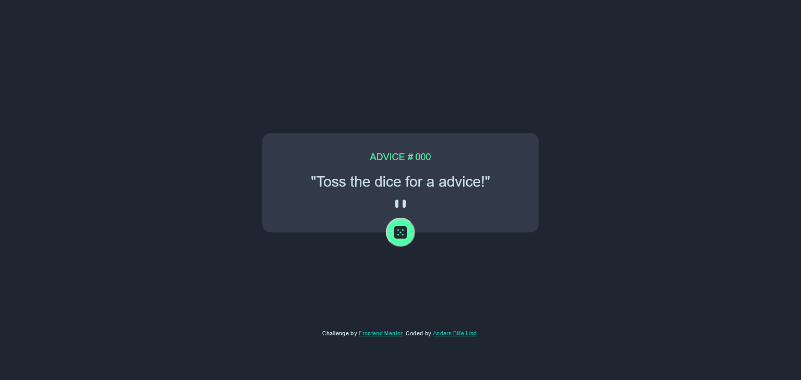
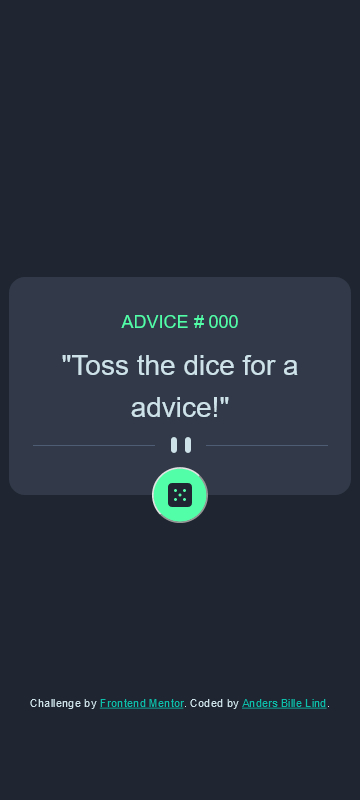

# Frontend Mentor - Advice generator app solution

This is a solution to the [Advice generator app challenge on Frontend Mentor](https://www.frontendmentor.io/challenges/advice-generator-app-QdUG-13db). Frontend Mentor challenges help you improve your coding skills by building realistic projects.

## Table of contents

- [Frontend Mentor - Advice generator app solution](#frontend-mentor---advice-generator-app-solution)
  - [Table of contents](#table-of-contents)
  - [Overview](#overview)
    - [The challenge](#the-challenge)
    - [Screenshot](#screenshot)
    - [Links](#links)
  - [My process](#my-process)
    - [Built with](#built-with)
    - [What I learned](#what-i-learned)
  - [Author](#author)

## Overview

### The challenge

Users should be able to:

-   Obtain an advice and its ID by clicking on the button.
-   View the advice generator in its optimal layout, depending on screen size.
-   See hover and actice states for the Dice.

### Screenshot




### Links

-   Solution URL: [Add solution URL here](https://github.com/billelind/frontend-mentor-challenges/advice-generator/)
-   Live Site URL: [Add live site URL here](https://billelind.github.io/frontend-mentor-challenges/advice-generator/)

## My process

### Built with

-   Semantic HTML5 markup
-   CSS custom properties
-   Flexbox
-   Mobile-first workflow

### What I learned

It was really nice to go back to some of the basics that might have been solved or made easier using a framework, where for the css i have grown custom to having my css prefixed by tailwindcss(which uses autoprefixer).

Since i tested this, really for the first time in firefox i noticed the cache settings was different causing it to display/"fetch" the same advice, which was fixed with a simple solution.

```js
fetch("https://api.adviceslip.com/advice", {
	mode: "cors",
	method: "GET",
	cache: "no-cache",
});
```

## Author

-   Website - [Anders Bille LInd](https://www.Billelind.dev)
-   Frontend Mentor - [@yourusername](https://www.frontendmentor.io/profile/billelind)
-   Github - [Billelind](https://www.github.com/billelind)
-   Linkedin - [Anders Bille Lind](<[https://](https://www.linkedin.com/in/anders-bille-lind-185074200/)>)
